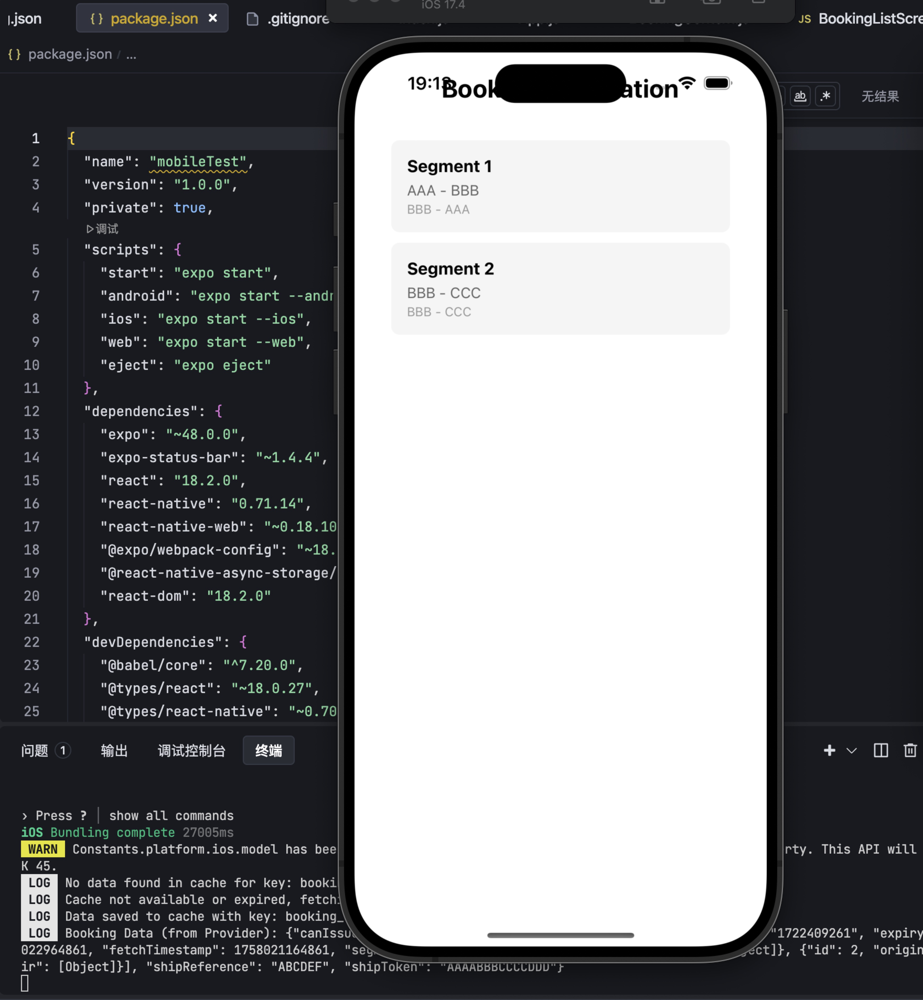
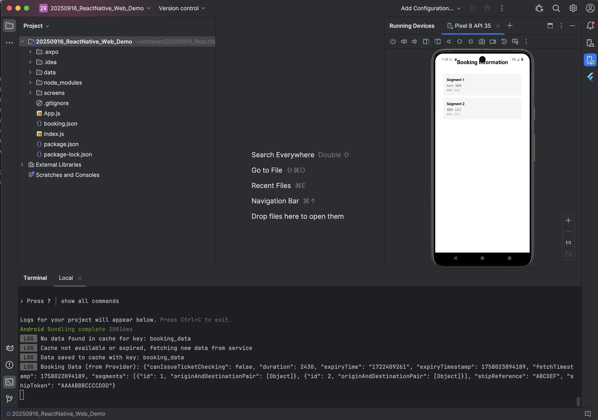
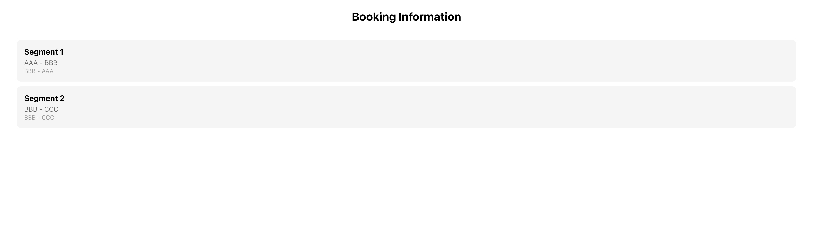

## Screenshots
### Mobile View


### Web View


# React Native + Web 项目 - 数据管理系统

## 项目概述
这是一个基于React Native + Web的跨平台项目，实现了完整的数据管理系统，包括Service层、本地持久化缓存层、数据时效性处理、刷新机制和统一接口。

## 项目结构
├── App.js               # 应用入口
├── booking.json         # Mock数据源
├── cache/                # 数据管理相关文件
│   ├── BookingContext.js    # React Context 实现的数据Provider
│   ├── BookingDataManager.js # 数据管理器
│   ├── BookingService.js    # Service层
│   └── CachingService.js    # 缓存层
├── screens/             # 页面组件
│   └── BookingListScreen.js # 列表展示页面
└── package.json         # 项目依赖配置

## 系统特点
- 📱 **跨平台支持**：同时支持React Native(Android/iOS)和Web
- 🗄️ **完整数据管理**：包含Service层、缓存层、时效性处理
- 🔄 **智能刷新机制**：支持数据过期自动刷新
- 📊 **统一接口**：提供简洁的API进行数据操作

## 执行命令

### 1. 安装依赖
```bash
npm install
```

### 2. 启动项目
```bash
# 启动React Native项目
expo start

# 启动Web项目
npm run web

# 启动开发服务器
npm start

```
### 3. 直接启动特定平台

```bash
# Web版本
npm run web

# Android版本
npm run android

# iOS版本
npm run ios

```

## 环境要求
- Node.js: 16
- npm: 8.0或更高版本
- 如需Android开发：Android Studio及Android SDK
- 如需iOS开发：Xcode(仅macOS)

## 项目功能说明
### 数据管理系统
- BookingDataManager : 核心数据管理器，协调Service层和缓存层
- BookingService : 处理数据获取逻辑，使用booking.json作为mock数据源
- CachingService : 实现本地持久化存储，使用AsyncStorage
- BookingContext : React Context实现，提供全局数据访问
### 页面功能
- BookingListScreen : 列表展示页面，自动获取数据并在控制台打印
- 支持空状态显示和加载状态处理
## 开发建议
1. 优先使用Web版本进行快速开发和测试
2. 确保Node.js版本符合要求
3. 修改数据结构时同步更新booking.json和相关数据处理逻辑
4. 需要持久化的新数据类型可以扩展CachingServic


React Native + Web Project - Data Management System
Project Overview
This is a cross-platform project based on React Native + Web, implementing a complete data management system that includes a Service layer, local persistent caching layer, data timeliness processing, refresh mechanism, and unified interfaces.

Project Structure
├── App.js # Application entry point
├── booking.json # Mock data source
├── cache/ # Data management related files
│ ├── BookingContext.js # Data Provider implemented with React Context
│ ├── BookingDataManager.js # Data Manager
│ ├── BookingService.js # Service Layer
│ └── CachingService.js # Caching Layer
├── screens/ # Screen components
│ └── BookingListScreen.js # List display screen
└── package.json # Project dependency configuration

System Features
📱 Cross-platform Support: Supports both React Native (Android/iOS) and Web

🗄️ Complete Data Management: Includes Service layer, caching layer, and timeliness processing

🔄 Smart Refresh Mechanism: Supports automatic data refresh upon expiration

📊 Unified Interfaces: Provides concise APIs for data operations

Execution Commands
1. Install Dependencies
bash
npm install
2. Start the Project
bash
# Start React Native project
expo start

# Start Web project
npm run web

# Start development server
npm start
3. Start Specific Platforms Directly
bash
# Web version
npm run web

# Android version
npm run android

# iOS version
npm run ios
Environment Requirements
Node.js: 16

npm: 8.0 or higher

For Android development: Android Studio and Android SDK

For iOS development: Xcode (macOS only)

Project Function Description
Data Management System
BookingDataManager: Core data manager, coordinating the Service layer and caching layer

BookingService: Handles data retrieval logic, using booking.json as a mock data source

CachingService: Implements local persistent storage using AsyncStorage

BookingContext: Implemented with React Context, providing global data access

Page Functions
BookingListScreen: List display screen, automatically fetches data and logs to console

Supports empty state display and loading state handling

Development Recommendations
Prioritize using the Web version for rapid development and testing

Ensure the Node.js version meets requirements

Synchronize updates to booking.json and related data processing logic when modifying data structures

New data types requiring persistence can extend the CachingService